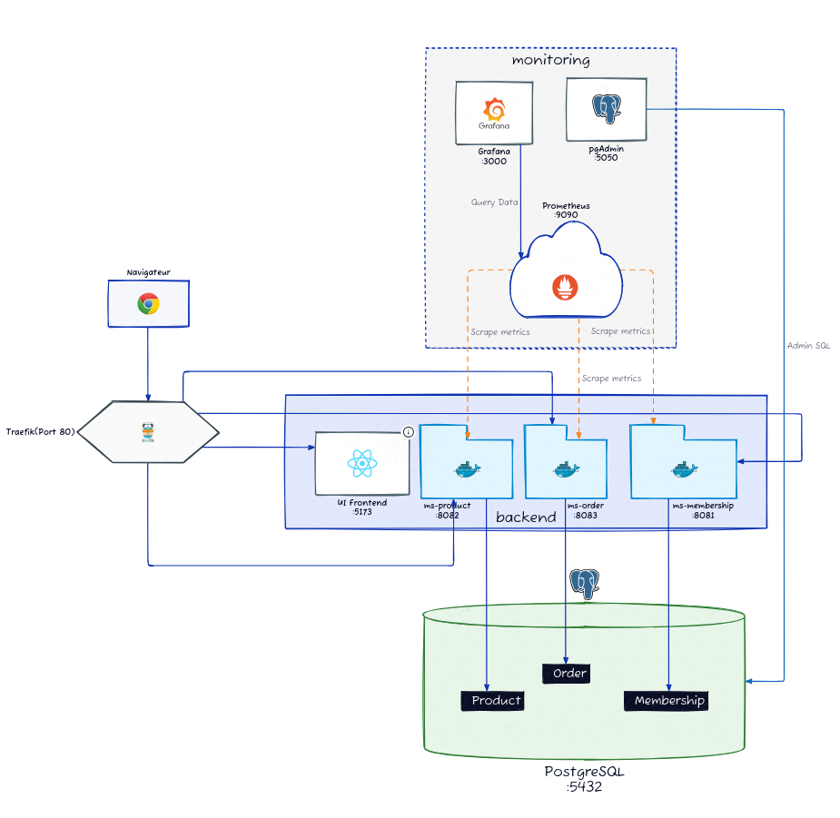

# Plateforme E-Commerce - Architecture Microservices

> Plateforme e-commerce complète développée avec une architecture microservices, Spring Boot 3.5, PostgreSQL et monitoring avec Prometheus/Grafana.

[](https://spring.io/projects/spring-boot)
[](https://openjdk.org/)
[](https://www.postgresql.org/)
[](LICENSE)

---

## Table des matières

- [Vue d'ensemble](#vue-densemble)
- [Architecture](#architecture)
- [Technologies](#technologies)
- [Prérequis](#prérequis)
- [Installation](#installation)
- [Utilisation](#utilisation)
- [Tests](#tests)
- [API Documentation](#api-documentation)
- [Monitoring](#monitoring)
- [Structure du projet](#structure-du-projet)

---

## Vue d'ensemble

Cette plateforme e-commerce est composée de **3 microservices indépendants** communiquant via des API REST, avec une infrastructure complète de monitoring et un reverse proxy Traefik.

### Fonctionnalités principales

- **Gestion des utilisateurs** (inscription, profil, recherche)
- **Catalogue produits** (CRUD, catégories, stock, recherche)
- **Gestion des commandes** (création, suivi, historique)
- **Communication inter-services** (RestTemplate, validation)
- **Monitoring temps réel** (Prometheus, Grafana)
- **Health checks** personnalisés pour chaque service
- **Métriques métier** (commandes, produits, utilisateurs)
- **Documentation API** (Swagger/OpenAPI)

---

## Architecture



### Services

| Service | Port | Description | Base de données |
|---------|------|-------------|-----------------|
| **ms-membership** | 8081 | Gestion des utilisateurs | PostgreSQL (ecommerce) |
| **ms-product** | 8082 | Catalogue produits | PostgreSQL (ecommerce) |
| **ms-order** | 8083 | Gestion des commandes | PostgreSQL (ecommerce) |
| **Traefik** | 80 | Reverse proxy | - |
| **PostgreSQL** | 5432 | Base de données | - |
| **pgAdmin** | 5050 | Administration BDD | - |
| **Prometheus** | 9090 | Métriques | - |
| **Grafana** | 3000 | Dashboards | - |

---

## Technologies

### Backend
- **Java 21** - Langage de programmation
- **Spring Boot 3.5.7** - Framework principal
- **Spring Data JPA** - Accès aux données
- **Spring Web** - API REST
- **Spring Validation** - Validation des données
- **PostgreSQL 16** - Base de données relationnelle
- **Lombok** - Réduction du boilerplate
- **MapStruct** - Mapping DTO/Entité

### Monitoring & Observabilité
- **Prometheus** - Collecte des métriques
- **Grafana** - Visualisation des métriques
- **Micrometer** - Instrumentation des métriques
- **Spring Actuator** - Health checks & endpoints de gestion

### Infrastructure
- **Docker & Docker Compose** - Containerisation
- **Traefik 3.4** - Reverse proxy & Load balancing
- **pgAdmin 4** - Interface d'administration PostgreSQL

### Tests
- **JUnit 5 (Jupiter)** - Framework de test
- **Mockito** - Mocking
- **AssertJ** - Assertions fluides
- **18 tests unitaires** au total

### Documentation
- **Swagger/OpenAPI 3** - Documentation API interactive

---

## Prérequis

- **Java 21** ou supérieur ([OpenJDK](https://openjdk.org/))
- **Maven 3.9+** ([Apache Maven](https://maven.apache.org/))
- **Docker & Docker Compose** ([Docker](https://www.docker.com/))
- **Git** ([Git](https://git-scm.com/))

---

## Installation

### 1. Cloner le repository

```bash
git clone <repository-url>
cd E-commerce-Tp-Platforme
```

### 2. Compiler les services

```bash
# Compiler tous les microservices
mvn clean install -pl ms-membership,ms-product,ms-order
```

### 3. Lancer l'infrastructure

```bash
# Démarrer PostgreSQL, Traefik, Prometheus, Grafana
docker-compose up -d postgres pgadmin traefik prometheus grafana
```

### 4. Lancer les microservices

**Option A: Avec Docker (recommandé)**
```bash
docker-compose up -d ms-membership ms-product ms-order
```

**Option B: En local avec Maven**
```bash
# Terminal 1 - Membership
cd ms-membership && mvn spring-boot:run

# Terminal 2 - Product
cd ms-product && mvn spring-boot:run

# Terminal 3 - Order
cd ms-order && mvn spring-boot:run
```

---

## Utilisation

### Accès aux services

| Service | URL | Credentials |
|---------|-----|-------------|
| **API Membership** | http://localhost/api/membership/api/v1/users | - |
| **API Product** | http://localhost/api/product/api/v1/products | - |
| **API Order** | http://localhost/api/order/api/v1/orders | - |
| **Swagger Membership** | http://localhost:8081/swagger-ui.html | - |
| **Swagger Product** | http://localhost:8082/swagger-ui.html | - |
| **Swagger Order** | http://localhost:8083/swagger-ui.html | - |
| **Grafana** | http://localhost:3000 | admin / admin |
| **Prometheus** | http://localhost:9090 | - |
| **pgAdmin** | http://localhost:5050 | admin@admin.com / admin |

### Exemples de requêtes

#### Créer un utilisateur
```bash
curl -X POST http://localhost/api/membership/api/v1/users \
  -H "Content-Type: application/json" \
  -d '{
    "firstName": "John",
    "lastName": "Doe",
    "email": "john.doe@example.com"
  }'
```

#### Créer un produit
```bash
curl -X POST http://localhost/api/product/api/v1/products \
  -H "Content-Type: application/json" \
  -d '{
    "name": "Laptop Pro",
    "description": "Ordinateur portable haute performance",
    "price": 1499.99,
    "stock": 10,
    "category": "ELECTRONICS"
  }'
```

#### Créer une commande
```bash
curl -X POST http://localhost/api/order/api/v1/orders \
  -H "Content-Type: application/json" \
  -d '{
    "userId": 1,
    "shippingAddress": "10 Rue de la Paix, 75002 Paris",
    "items": [
      {"productId": 1, "quantity": 1},
      {"productId": 2, "quantity": 2}
    ]
  }'
```

---

## Tests

### Lancer tous les tests

```bash
# Tous les services
mvn test

# Service spécifique
cd ms-membership && mvn test
cd ms-product && mvn test
cd ms-order && mvn test
```

### Couverture des tests

| Service | Nombre de tests | Statut |
|---------|----------------|--------|
| **ms-membership** | 5 tests | OK |
| **ms-product** | 4 tests | OK |
| **ms-order** | 9 tests | OK |
| **Total** | **18 tests** | **200%** |

Tous les tests utilisent `@DisplayName` pour une meilleure lisibilité.

---

## API Documentation

Chaque microservice expose sa documentation OpenAPI/Swagger:

- **Membership API**: http://localhost:8081/swagger-ui.html
- **Product API**: http://localhost:8082/swagger-ui.html
- **Order API**: http://localhost:8083/swagger-ui.html

### Collection Postman

Une collection Postman complète est disponible dans `postman/platform-tests.json` avec:
- Scénario complet (Happy Path)
- Tests d'erreur (User inexistant, rupture de stock)
- Tests de tous les endpoints

---

## Monitoring

### Health Checks

Vérifier la santé des services:

```bash
curl http://localhost/api/membership/actuator/health
curl http://localhost/api/product/actuator/health
curl http://localhost/api/order/actuator/health
```

### Prometheus

Accédez aux métriques: http://localhost:9090

**Métriques personnalisées:**
- `products_created_total` - Produits créés par catégorie
- `orders_by_status` - Commandes par statut
- `orders_total_amount_today` - Montant total des commandes du jour

### Grafana

Dashboards disponibles: http://localhost:3000

- **Dashboard général**: Vue d'ensemble des 3 services
- **Dashboard métier**: KPIs e-commerce (commandes, produits, CA)

Credentials: `admin` / `admin`

---

## Structure du projet

```
E-commerce-Tp-Platforme/
├── ms-membership/           # Service gestion utilisateurs
│   ├── src/
│   │   ├── main/
│   │   │   ├── java/.../
│   │   │   │   ├── application/   # DTOs, Services, Mappers
│   │   │   │   ├── domain/        # Entities, Repositories
│   │   │   │   └── infrastructure/ # Controllers, Exceptions, Health
│   │   │   └── resources/
│   │   │       ├── application.yml
│   │   │       └── data.sql
│   │   └── test/java/...          # 5 tests unitaires
│   └── pom.xml
│
├── ms-product/              # Service catalogue produits
│   ├── src/
│   │   ├── main/java/.../
│   │   │   ├── application/
│   │   │   ├── domain/
│   │   │   └── infrastructure/
│   │   └── test/java/...          # 4 tests unitaires
│   └── pom.xml
│
├── ms-order/                # Service gestion commandes
│   ├── src/
│   │   ├── main/java/.../
│   │   │   ├── application/
│   │   │   ├── domain/
│   │   │   └── infrastructure/
│   │   └── test/java/...          # 9 tests unitaires
│   └── pom.xml
│
├── reverse-proxy/           # Configuration Traefik
│   ├── traefik.yml
│   └── dynamic.yml
│
├── monitoring/              # Configuration Prometheus/Grafana
│   ├── prometheus.yml
│   ├── grafana/
│   └── MONITORING.md
│
├── architecture/            # Documentation architecture
│   └── DAT.md
│
├── postman/                 # Collection tests API
│   └── platform-tests.json
│
├── docker-compose.yml       # Orchestration complète
├── DEPLOYMENT.md            # Guide de déploiement
└── README.md                # Ce fichier
```

---

## Équipe

**Développeurs:**
- Michel
- Gaby

Projet réalisé dans le cadre du TP1 - Orchestration des microservices

**EPISEN - Ing3 Orchestration des microservices**

---

## Support

Pour toute question ou problème:
- Email: michel.eloka@etu.u-pec.fr / gaby.njonou-kouaya@etu.u-pec.fr
- Documentation: [DEPLOYMENT.md](DEPLOYMENT.md)
- Health Checks: http://localhost/api/*/actuator/health

---

**Si ce projet vous a été utile, n'hésitez pas à lui donner une étoile sur GitHub!**
